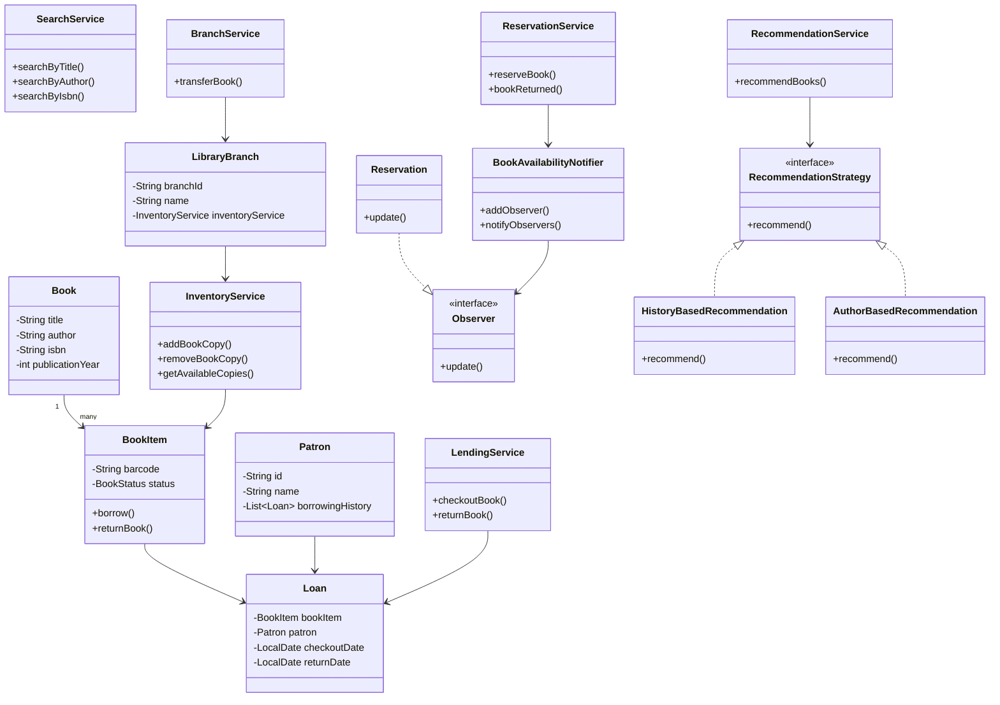

# Library Management System

## Overview

This project implements a **Library Management System in Java** designed to help librarians manage books, patrons, and lending processes efficiently.
---

# Features

## 1. Book Management

- Add books to the system
- Remove books from inventory
- Update book information
- Search books by:
    - Title
    - Author
    - ISBN

Each book can have multiple physical copies represented by `BookItem`.

---

## 2. Patron Management

The system supports library member management.

Features include:

- Register new patrons
- Update patron information
- Track borrowing history

Each patron maintains a list of `Loan` records that represent previously borrowed books.

---

## 3. Lending Process

The system supports complete lending functionality:

- Checkout books
- Return books
- Track checkout date and return date

Each lending transaction is represented by a `Loan` object.

---

## 4. Inventory Management

The system maintains a record of:

- Available book copies
- Borrowed book copies
- Book copies across branches

Each book copy is represented by a `BookItem`.

---

# Optional Extensions

## Multi-Branch Support

The system supports multiple library branches.

Features:

- Each branch maintains its own inventory
- Books can be transferred between branches

Classes involved:

- `LibraryBranch`
- `BranchRepository`
- `BranchService`

---

## Reservation System

Patrons can reserve books that are currently borrowed.

When a reserved book becomes available, the system automatically notifies the patron.

This functionality is implemented using the **Observer Design Pattern**.

Classes involved:

- `Observer`
- `Reservation`
- `BookAvailabilityNotifier`
- `ReservationService`

---

## Recommendation System

The system recommends books to patrons based on their borrowing history.

This functionality uses the **Strategy Design Pattern**, allowing different recommendation algorithms to be plugged in.

Implemented strategies include:

- History-based recommendation
- Author-based recommendation

Classes involved:

- `RecommendationStrategy`
- `HistoryBasedRecommendation`
- `AuthorBasedRecommendation`
- `RecommendationService`

---

# Design Patterns Used

### 1. Builder Pattern

Used for constructing `Book` objects.

Example:

```java
Book book = Book.builder()
        .title("Clean Code")
        .author("Robert Martin")
        .isbn("ISBN001")
        .publicationYear(2008)
        .build();
```


### 2. Observer Pattern

Observer Pattern

Used in the `reservation system`.

When a book is returned, all registered observers (patrons with reservations) are notified automatically.


### 3. Strategy Pattern

Used in the `recommendation system`.

Different recommendation algorithms can be swapped dynamically.


## Class Diagram

